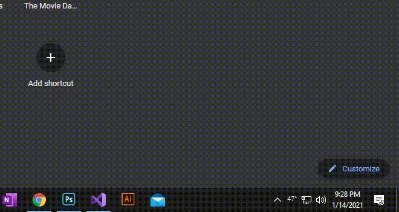

# weather-frog

Update desktop background with weather conditions and playful illustrations based on the weather.

A C# WPF Windows desktop application that adds a taskbar icon which you can configure to display either the current temperature or an icon representing the current weather condition. Click the taskbar icon to reveal a popup which displays current weather conditions and an hourly forecast with a graph of the temperature for the day.  

As shown in the above gif, this is a work in progress. The frog illustrations are being drawn. Once (if?, no once) finished, they will go in the blank space at the bottom of the popup. There's also still a few weather condition icons left to be drawn.  

The application can also (configurable) update the desktop background with the current weather conditions. It looks basically like the above popup before displaying the hourly forecast.  

The application uses data from WeatherAPI.com, but is not endorsed or associated with the company. An API Key is needed to run the program. There's a free version that provides 3 days of forecast. You can obtain a key by following the URL below.  
https://www.weatherapi.com/signup.aspx
